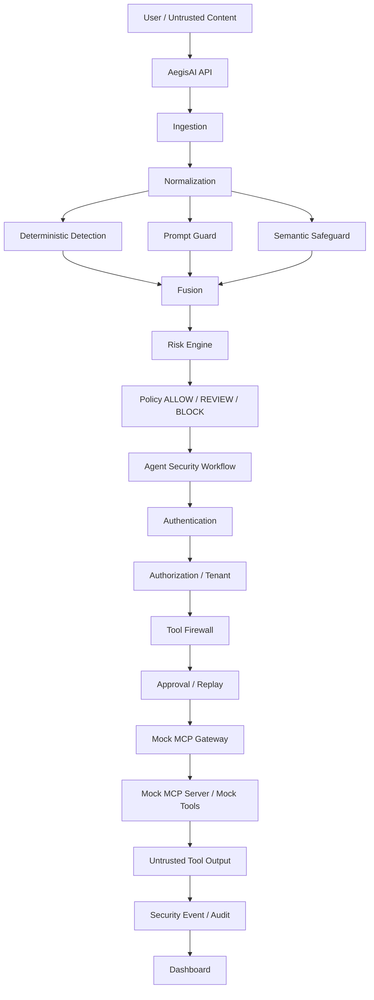

# AegisAI — Final Architecture (Hackathon Freeze)

**Status:** Architecture FROZEN at Phase 17. Phase 18 = validation & submission packaging only.  
**Production status:** NOT production-ready.

## High-level



## Detection pipeline

```text
SecurityInput
 → Rules (9 taxonomy detectors)
 → Prompt Guard (Groq)
 → Semantic Safeguard (Groq)
 → Fusion (evidence, not naive average)
 → Risk (0–100 + factors)
 → Policy (ALLOW | REVIEW | BLOCK)
```

Provider failure → UNAVAILABLE / UNCERTAIN — never silent BENIGN.

## Agent / tool security pipeline

```text
Policy → Action proposal → Intent alignment
 → Authn → Authz → Tool Firewall
 → Approval binding → Replay registry
 → Mock execute OR Mock MCP
 → TOOL_OUTPUT trusted=false
```

## Authentication / authorization

- Development bearer tokens from environment
- Protected APIs require capabilities (e.g. `audit:read:own-tenant`)
- Authenticated tenant is authoritative; client cannot override principal/tenant
- `/health` remains PUBLIC

## MCP security boundary

```text
Authn → Authz → Policy → Firewall → Integrity fingerprint
 → Shadowing check → Schema validation → MockMCPServer
 → Output always untrusted
```

Approved demo server only: `aegis-demo-mcp`. No arbitrary URLs. No real MCP networking.

## Audit / persistence

Security events store content **hash**, labels, scores, reason codes, and sanitized metadata.  
Never: raw prompts, API keys, bearer tokens, passwords.

## Explicit non-goals (frozen out)

- Real MCP networking
- Production OAuth/OIDC/SSO
- Real email / shell / DB mutation / arbitrary HTTP
- Threshold tuning for presentation metrics
